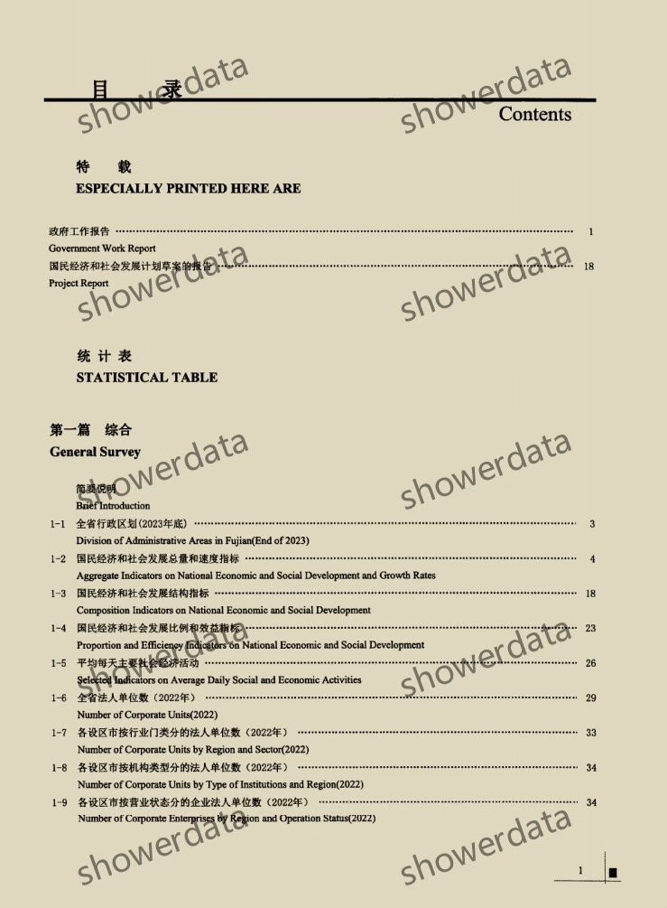
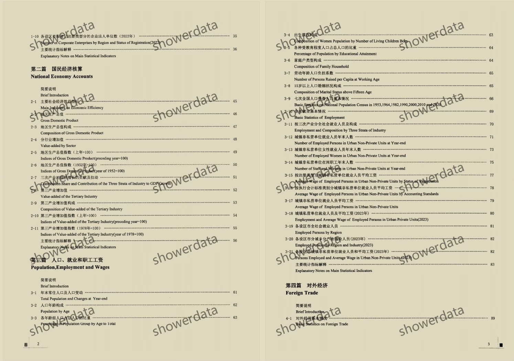
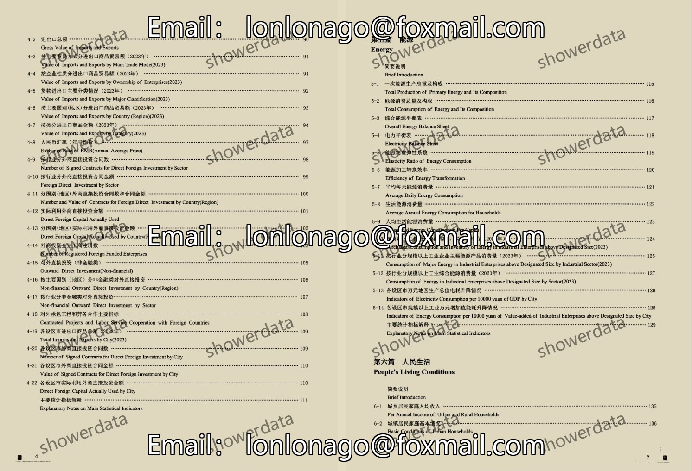
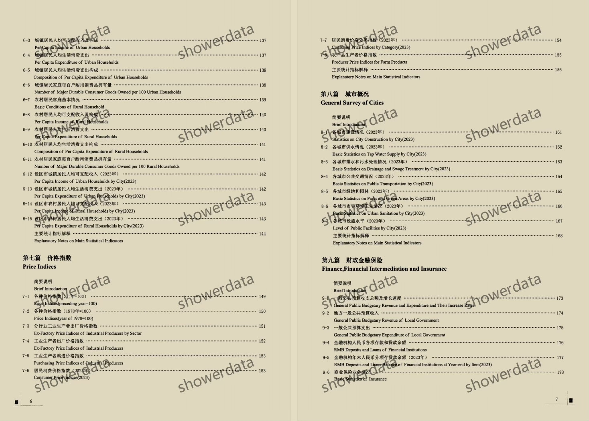
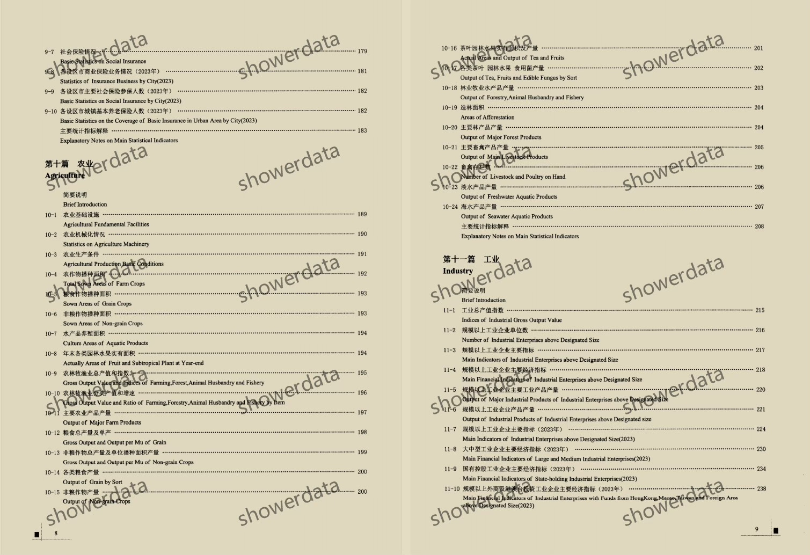
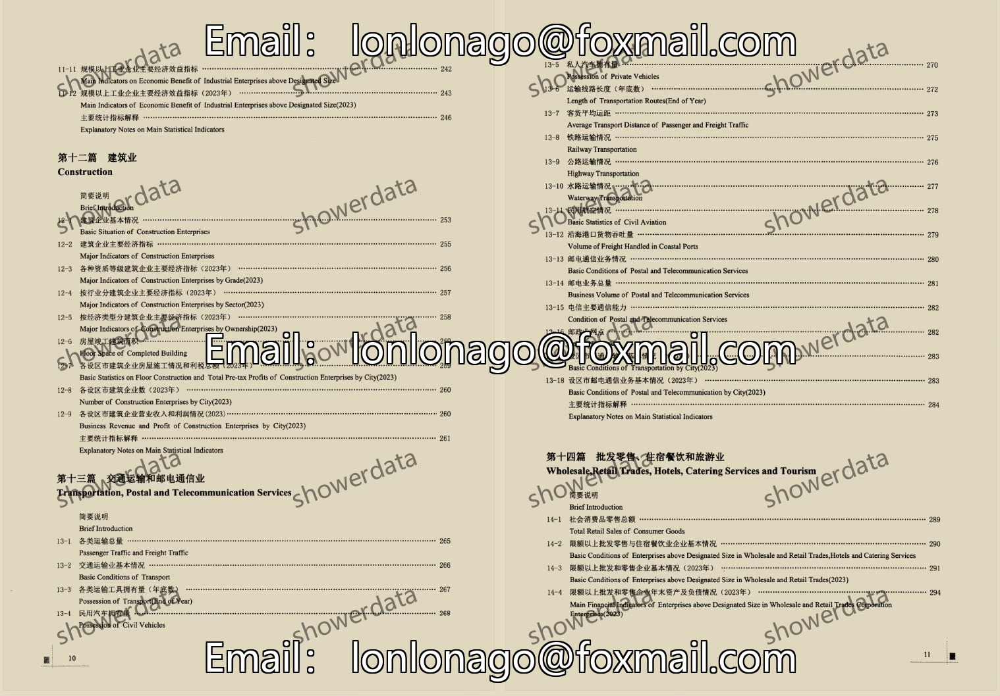
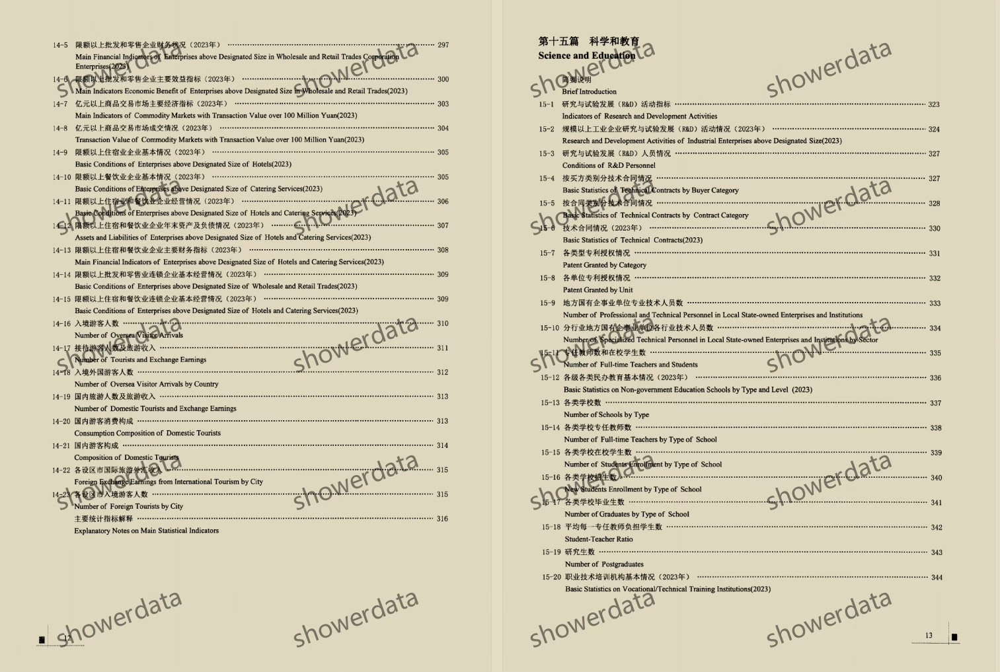
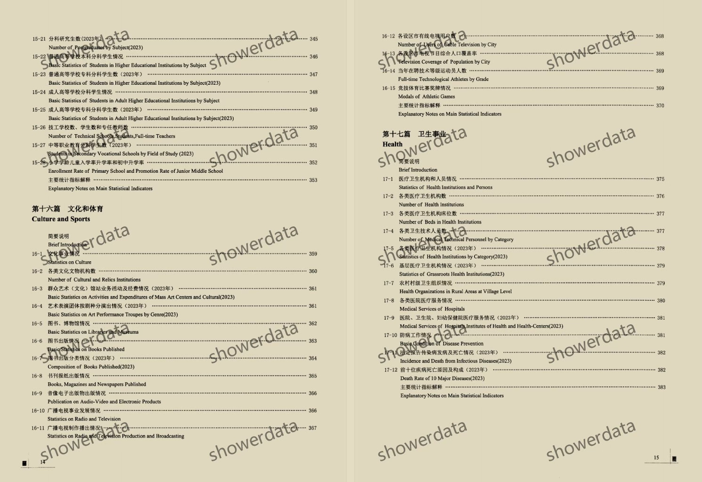

## Body

"Fujian Statistical Yearbook" (1983-2025)

Data Year: The title year is the year the data was compiled, so the data year needs to be one less than the title year.
Please check the image below before purchasing! The complete display of instructions has been provided, please confirm if you need it before purchasing! No returns or exchanges will be accepted after shipment.

01. Data Introduction
"Fujian Statistical Yearbook"

02. Indicator Details
(1) The directory is displayed in the image, please take a look on your own and make a purchase accordingly. If you need help finding specific indicators, they are all here. After shipment, there will be no return or exchange without any reason.
(2) The display directory is for the year 2024, and the content is lengthy. Different years may have varying statistical standards, academic common sense, and the data recorded in statistical materials is based on the previous year's data as well. Please be aware of this.
(3) The EXCEL format data is organized from original materials, including the content of the original data but not the text content.
(4) If the material is placed in a zipped package, you need to save the zipped package first, then download, and then extract.
(5) If there is Excel protection, you can select all and copy to a new sheet to use.

03. Data Format
1983-2024: PDF and Excel
2025: Excel

## Images

item_1008735377904

Here is a pay link on Stripe ( https://buy.stripe.com/3cs8yP7sY87d0vu9AB ). Please contact me lonlonago@foxmail.com after funding $89, and I will send you a complete data files , thank you!

